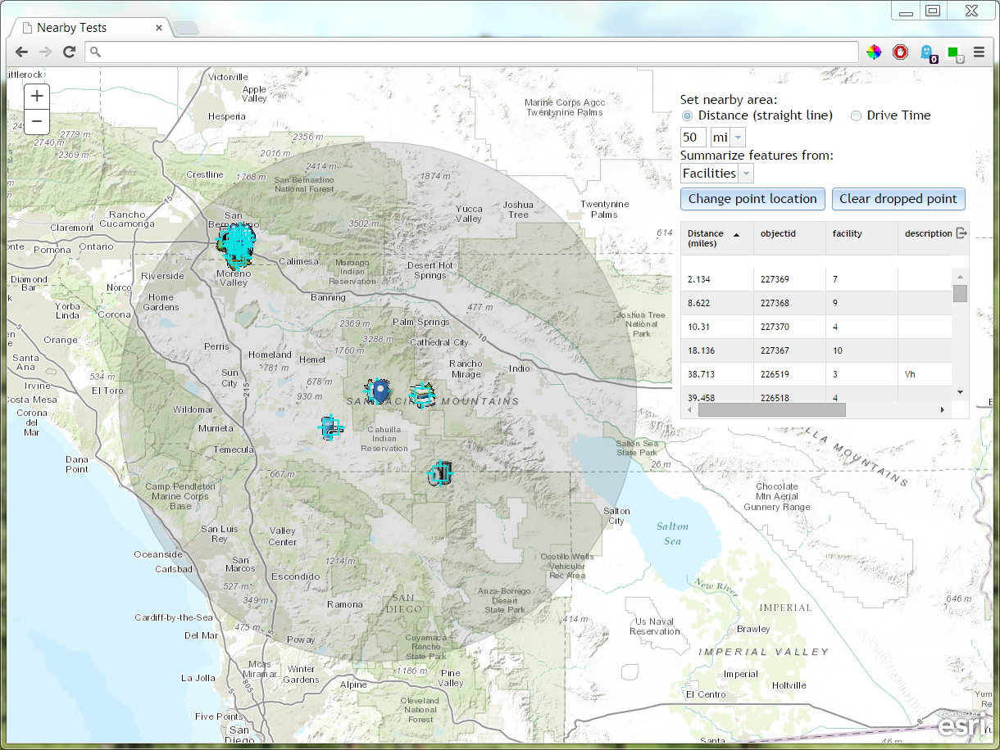

dojo-esri-nearby-widget
=================
Nearby widget for the esri js api.


```javascript
var nearbyWidget = new Nearby({
	map: this.map, //reference to the jsapi map object
}, "referenceNode");
nearbyWidget.startup();
```

[Click for demo](http://brianbunker.github.com/dojo-esri-nearby-widget)

Screen from Sample page:




TODO
====
- Support for Image urls (problematic because url doesn't necessarily have file extension and need to request image/convert to base64)
- Add multiple files to the map at once
